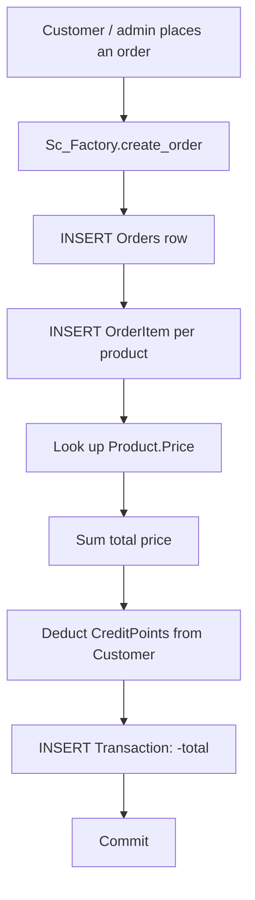

<!-- 1) BANNER -->
<p align="center">
  
</p>

<!-- 2) TYPING SVG -->
<p align="center">
  <a href="https://github.com/dyntr">
    
  </a>
</p>

<!-- 3) BADGES -->
<p align="center">
  
  
  
  
  
</p>

## Overview

A larger "ročníková práce" school project built as two apps sharing one MySQL database: a Flask storefront for customers (browse, cart, checkout, account) and a separate command-line admin console (`src/`) for full CRUD on the same data — customers, products, orders, order items and transactions.

## ✦ Features

- **Flask storefront** (`website/`) — product listing & search, filter by product type, session-based cart, checkout, order history, login/registration, account editing. Templates are rendered with Jinja2 via `render_template` despite the `.php` file extension — a naming leftover from an earlier plan to use PHP, not actual PHP execution.
- **CLI admin console** (`src/`) — an interactive menu-driven tool built around Factory classes (`CustomerFactory`, `ProductFactory`, `OrdersFactory`, `OrderItemFactory`, `TransactionFactory`) that each implement create/read/update/delete for their table.
- **`Sc_Factory.create_order()`** performs a full checkout server-side in one place: inserts the order, inserts each order item, deducts the customer's credit-point balance by the order total, and logs a `Transaction` row.
- **`GenerateReportFactory`** builds a plain-text summary report — total credit points and customer count per city, total sales per product type.
- **`ImportFactory`** bulk-loads customers, products, orders, order items or transactions from CSV, JSON, or XML into any table.
- **Singleton DB connection** (`DbConnection`) reads `config/config.ini` and hands out one shared `mysql-connector-python` connection.
- **Tests** with `pytest` covering the DB connection, auth flows, and views.
- Ready-to-run MySQL dump (`sql/script.sql`) defining the schema: `customer`, `product`, `orders`, `orderitem`, `transaction`.

## 🛠 Built with

Flask, Flask-Bootstrap, Flask-WTF, Flask-Session, `mysql-connector-python`, pytest.

## 🧭 Order flow



## 📦 Getting started

Requires Python 3 and a local MySQL server.

```bash
pip install -r config/requirements.txt

# creates the `rocnikovka` schema, tables and seed data
mysql -u root -p < sql/script.sql

# storefront -> http://127.0.0.1:5000 (run from Database_app/, NOT from inside website/)
python3 -m website.main

# admin console (separate terminal, run from Database_app/src)
cd src && python3 main.py
```

Both apps read the same `config/config.ini` for the MySQL connection — no credentials are included here; point it at your own local MySQL instance.

## 🎓 What I learned

Splitting a customer-facing app and an admin tool over one shared database, the Factory pattern for table-level CRUD, Flask blueprints/sessions/auth, and writing tests (pytest) alongside the application instead of after it. Also a concrete lesson in what to fix first on a revisit: this version stores customer passwords in plaintext, whereas the `order-management-gui` project (built later) hashes them with SHA-256 — a good example of the same author's security habits improving between projects.

## 🚀 Status

Built during studies at SPŠE Ječná (larger year project) — a school project, not a real store; noted honestly rather than hidden.

<!-- FOOTER -->
---
<p align="center">
  <sub>Part of <a href="https://github.com/dyntr">Patrick Dyntr's</a> portfolio · Built by <a href="https://github.com/dyntr">@dyntr</a></sub>
</p>
